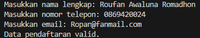
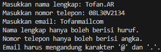

# Studi Kasus : Validasi Form Input

- Nama : Roufan Awaluna Romadhon
- NIM : 312410423
- Kelas : TI.24.A.3

---

## Deskripsi
Program ini adalah solusi sederhana untuk memastikan validitas data yang dimasukkan pengguna pada sebuah form pendaftaran online. Dengan aturan validasi yang jelas, program ini membantu mencegah kesalahan input seperti nama yang mengandung angka, nomor telepon yang bukan angka, atau format email yang tidak sesuai. Program ini langsung memberikan umpan balik kepada pengguna mengenai kesalahan yang terjadi sehingga data yang diterima menjadi lebih akurat dan dapat diandalkan.

---

## Program Manajemen Data Nilai Mahasiswa

### Deskripsi Program:
Program ini dirancang untuk melakukan validasi input pada aplikasi registrasi online. Program ini memastikan bahwa data yang dimasukkan oleh pengguna sesuai dengan aturan yang telah ditetapkan, seperti nama lengkap yang hanya boleh mengandung huruf, nomor telepon yang harus berupa angka, dan email yang harus memiliki format yang valid dengan karakter `@` dan `.`. Hasil dari proses validasi ini akan menentukan apakah data registrasi dianggap valid atau tidak.

### Kode Program
Kode program dapat dilihat dibawah ini atau buka file ini [`ValidasiFormInput.py`](ValidasiFormInput.py).
```python
import re

def validate_form(nama_lengkap, nomor_telepon, email):
    errors = []

    # Validasi nama lengkap (hanya huruf)
    if not nama_lengkap.replace(" ", "").isalpha():
        errors.append("Nama lengkap hanya boleh berisi huruf.")

    # Validasi nomor telepon (hanya angka)
    if not nomor_telepon.isdigit():
        errors.append("Nomor telepon hanya boleh berisi angka.")

    # Validasi email (mengandung '@' dan '.')
    if "@" not in email or "." not in email:
        errors.append("Email harus mengandung karakter '@' dan '.'.")

    if errors:
        for error in errors:
            print(error)
    else:
        print("Data pendaftaran valid.")

# Input data
nama_lengkap = input("Masukkan nama lengkap: ")
nomor_telepon = input("Masukkan nomor telepon: ")
email = input("Masukkan email: ")

# Validasi data
validate_form(nama_lengkap, nomor_telepon, email)

```

### Penjelasan Program:
1. **Validasi Nama Lengkap:**
   - Program memeriksa apakah input hanya mengandung huruf dengan menggunakan fungsi `isalpha()`.
   - Untuk mengabaikan spasi pada nama lengkap, digunakan metode `replace(" ", "")` sehingga spasi dihilangkan sementara.
   - Jika input tidak memenuhi kriteria, akan ditambahkan pesan error: "Nama lengkap hanya boleh berisi huruf."

2. **Validasi Nomor Telepon:**
   - Program memastikan bahwa input hanya terdiri dari angka dengan fungsi `isdigit()`.
   - Jika input tidak hanya angka, maka akan ditambahkan pesan error: "Nomor telepon hanya boleh berisi angka."

3. **Validasi Email:**
   - Program memeriksa apakah input mengandung karakter `@` dan `.` sebagai bagian dari format email yang valid.
   - Jika salah satu dari karakter tersebut tidak ada, akan ditambahkan pesan error: "Email harus mengandung karakter '@' dan '.'."

4. **Pesan Hasil Validasi:**
   - Jika ada satu atau lebih kesalahan dalam input, program akan mencetak semua pesan error yang terdeteksi.
   - Jika tidak ada kesalahan dalam input (semua validasi berhasil), program akan mencetak pesan: "Data pendaftaran valid."

5. **Input Data Pengguna:**
   - Pengguna diminta untuk mengisi tiga data: nama lengkap, nomor telepon, dan email melalui fungsi `input()`.

6. **Proses Validasi:**
   - Fungsi `validate_form` dipanggil dengan parameter berupa data yang dimasukkan oleh pengguna.
   - Proses validasi dilakukan sesuai dengan kriteria pada poin 1-3.

### Screenshot Hasil Eksekusi Program:
Berikut adalah hasil eksekusi programnya:

Jika Valid:


Jika Tidak Valid:
